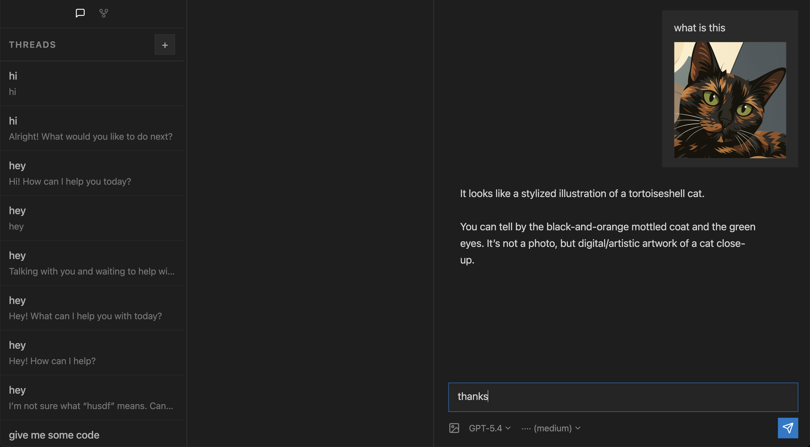

A runtime built on the OpenAI Responses API with [WebSocket mode](https://developers.openai.com/api/docs/guides/websocket-mode), Go, NATS + JetStream and Postgres. React + Vite frontend using the React Compiler. The core loop works now — you can drop PDFs into a collection, chat over them in a thread, and have the model cite specific pages that actually open to the right place in the viewer. Pixel-perfect region highlights (the model points at the exact sentence it's quoting, not just the page) are being wired up next — the OCR service and the viewer painter are already in, the glue between them is the current focus.

There is no provider abstraction layer, so Azure OpenAI does not work. ZDR is not on — I'm staying close to OpenAI's default behaviour while I explore what opens up with `previous_response_id` and warm sockets, and I do not want to be constrained there yet. Your data might be logged by OpenAI while this is the case.



## What it does

- **Thread execution on persistent worker-owned WebSockets.** A worker dials OpenAI once and keeps the socket warm. Response continuity via `previous_response_id`, so subsequent turns pick up without resending context.
- **Parallel child-thread fan-out.** A parent spawns N children on separate sockets, each doing its own thing, and the results regroup through a barrier.
- **Warm branching.** Children fork from a parent's accumulated context rather than starting cold. An exploration thread does not have to re-ingest the whole conversation.
- **Document collections attached to threads.** Upload PDFs, group them into collections, attach a collection to a thread. The model sees `<available_documents>` in its runtime context block and can call `query_document` to pull answers out of a specific doc.
- **`query_document` pins per-doc context to the tool call, not the main thread.** Each tool call carries its own document context; the main thread stays clean. Means cross-document questions don't turn the main thread into a wall of text.
- **Clickable page citations.** The model emits `[page 25](/doc/123?page=25)` in its answer and clicking one opens the PDF viewer on page 25. No full reload.
- **Pixel-perfect bounding-box citations.** URLs can carry `?cite=page,x,y,w,h` and the viewer paints a translucent yellow highlight on that region. Coordinates come from a PaddleOCR microservice (see `services/paddleocr/`) that runs on a GPU droplet and extracts per-line bboxes from every page at ingest.
- **Sticky worker ownership** tracked in Postgres — commands route directly to the worker that owns a thread.
- **Durable transport via NATS + JetStream** with idempotent delivery and replay safety.
- **Postgres-backed runtime state and durable history.**

## The evidence chain - in progress, not yet implemented

When a user asks something that needs grounding in a document:

1. The model calls `query_document` with a specific document id. Runs on a pinned tool-call context — main thread untouched.
2. The tool returns the answer text plus the bounding box of the supporting region, pulled from the OCR data generated at ingest.
3. The model composes its response with a markdown link encoding the page and the bbox: `[page 25](/doc/123?page=25&cite=25,120,340,780,80)`.
4. The user clicks. The viewer jumps to page 25 and highlights the exact pixel region that was cited.

No guessing coordinates. The model can only cite what OCR actually saw.

## Design principle

The core worker's job is to manage the OpenAI WebSocket lifecycle, thread operations, and persistence of received events to JetStream or Postgres. It is oblivious to everything else in the app. Consumers of events know which events to listen for and what to do with the output, but the worker does not know about them. Keeping that boundary clean is the main reason the rest of the app has been able to move as fast as it has.

## Running

```bash
cp .env.example .env
# set OPENAI_API_KEY

docker compose up -d --build
```

The OCR service in `services/paddleocr/` is deployed separately on a GPU droplet. See that service's own compose file for how it runs.

## Rough edges

- **You can actually run this now**, but it is not production-ready. Things will break.
- **OpenAI has burned credits on us.** A validation bug once turned unrecoverable failures into an infinite retry loop. The fix is merged, but that neighbourhood is worth watching. Keep an eye on your billing dashboard.
- **Not ZDR-compatible.** See the opening paragraph.
- **Azure OpenAI does not work**, and will not until there is a provider abstraction.
- **AI agents will try to talk you into an abstraction of the Responses API event shape.** Don't let them. We stay close to the raw event shape throughout the frontend, backend, and storage because it is easier to reason about and cheaper to debug.
- **Some npm packages an AI agent recommends have not been maintained in years.** Always check. If the popular one is stale, look for an active fork or a different library entirely.
- **IDs are integers for now**, not UUIDs. Easier to read logs and paths during early development. That can switch later if there is a reason.
