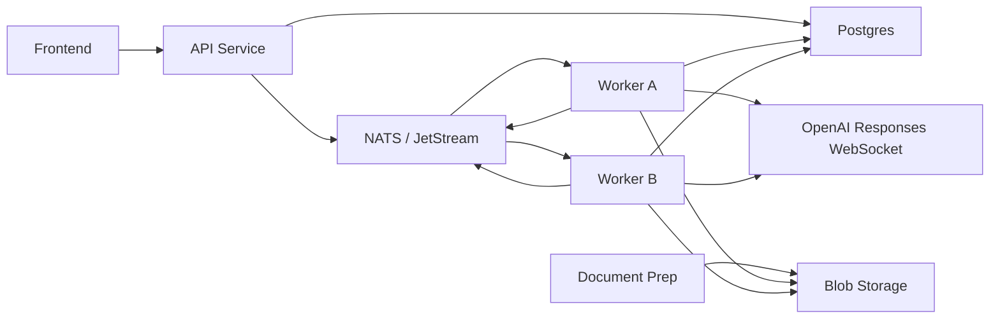

# Architecture

## Goals

- Keep the backend native to OpenAI Responses WebSocket mode.
- Keep the worker focused on execution, recovery, and orchestration.
- Let root and child threads share one runtime model.
- Keep document preparation and image ingestion outside worker core.

## Runtime Split

- Postgres holds durable runtime truth: thread snapshots, ownership, dedupe, item history, response storage, spawn groups, spawn results, and thread-document links.
- NATS + JetStream carries command delivery and thread history:
  - `THREAD_CMD` for durable commands
  - `THREAD_EVENTS` for live browser fanout
  - `THREAD_HISTORY` for durable `client.response.create` checkpoints and raw socket history
- Blob storage holds large source artifacts such as prepared input packages, document pages, and image bytes.

## Component Model

## Core Invariants

- A thread has at most one live owner record.
- Only the owner worker may write to that thread's socket.
- Commands for a thread are serialized through one actor mailbox.
- A thread never runs two responses at once.
- Recovery rebuilds actor state from Postgres plus the latest `client.response.create` checkpoint in `THREAD_HISTORY`.
- Parent and child threads use the same persistence and command model.
- Document queries also use that same parent/child thread model; they are not a separate executor runtime.

## Main Flow

1. The API creates the thread row in Postgres.
2. The API publishes `thread.start` to `THREAD_CMD`.
3. A worker claims ownership in Postgres and opens the socket.
4. The worker sends `response.create` and persists thread snapshots, items, responses, and spawn state to Postgres.
5. The worker publishes live raw OpenAI events (minus reasoning deltas and child-thread deltas) to `THREAD_EVENTS` with an additive identity tuple (`thread_id`, `root_thread_id`, `parent_thread_id`), and durable raw history to `THREAD_HISTORY`.
6. Recovery or adoption reloads the thread from Postgres and resumes from the latest durable checkpoint.

## Document Query Model

- Thread attachments live in `thread_documents`.
- Send-time runtime context advertises attached documents and injects `query_attached_documents`.
- When the model chooses that tool, the worker spawns one child thread per requested document.
- Those child threads persist, publish events, and recover exactly like any other thread.

## Storage Rules

- Keep semantic thread state compact and queryable in Postgres.
- Keep exact socket history in JetStream, not in relational rows.
- Keep large binary or prepared artifacts behind blob references.
- Do not let source-specific document logic leak into thread actor core.
