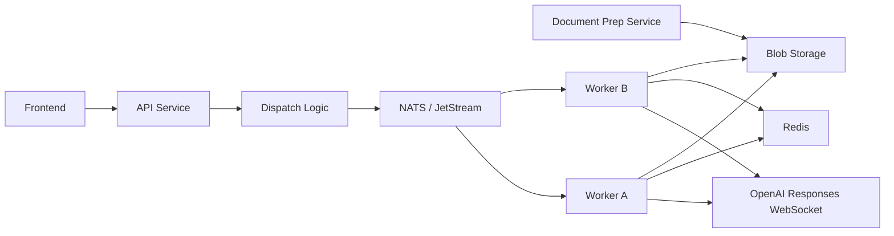
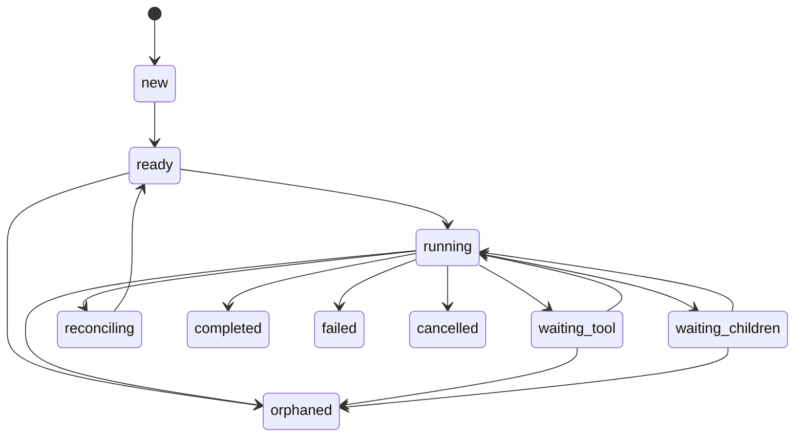

# Architecture

## Goals

- Build a backend that is native to OpenAI Responses WebSocket mode
- Keep the internal model as close as possible to the Responses API
- Allow a main thread to spawn many depth-1 child threads
- Preserve sticky worker ownership so every thread resumes on the correct warm socket
- Keep the system simple enough for a strong v1 while leaving room for future multi-depth execution

## Hard Constraints

- One active OpenAI WebSocket per active thread
- One in-flight response per thread actor at a time
- Workers are the only processes allowed to own WebSocket connections
- Redis is the runtime source of truth for ownership and live state
- NATS + JetStream is the transport for backend commands
- Child threads are first-class threads, not a special side channel
- Document preparation happens outside the thread runtime
- The runtime consumes prepared manifest and page-asset references only

## Terminology

### Responses-Aligned Objects

- `response`
  - The raw OpenAI response object
  - Stored with minimal transformation
  - `response_id` is treated as the run identifier
- `item`
  - Any raw Responses item in sequence order
  - Examples: `message`, `function_call`, `function_call_output`, reasoning items

### Thin Runtime Layer

- `thread`
  - The minimal execution envelope that binds a sequence of responses to a worker, socket, and orchestration state
- `spawn_group`
  - A barrier record used when one parent thread waits for a set of child threads to finish

## Component Model



Document prep is intentionally not inside the worker runtime. Workers only consume prepared document artifacts from blob storage.

## Runtime Objects

### Thread

The `thread` object is the smallest custom wrapper required to run a Responses-native system.

Required fields:

- `id`
- `root_thread_id`
- `parent_thread_id`
- `parent_call_id`
- `depth`
- `owner_worker_id`
- `socket_generation`
- `socket_expires_at`
- `last_response_id`
- `active_response_id`
- `status`
- `model`
- `instructions`
- `metadata`

Interpretation:

- A root thread has `parent_thread_id = null`
- A child thread has `parent_thread_id != null` and `depth = 1` in v1
- `last_response_id` is the last stable response known to be persisted
- `active_response_id` is non-null only while a response is in flight or being reconciled

### Spawn Group

The `spawn_group` is the only orchestration-specific object required in v1.

Required fields:

- `id`
- `parent_thread_id`
- `parent_call_id`
- `expected`
- `completed`
- `failed`
- `cancelled`
- `status`
- `child_thread_ids`
- `aggregate_submitted_at`
- `aggregate_cmd_id`

Interpretation:

- A parent tool call such as `spawn_subagents` produces exactly one `spawn_group`
- Each child thread belongs to one spawn group
- The parent resumes only after the group reaches a terminal barrier state
- The aggregate tool output is submitted exactly once per spawn group

## Core Invariants

- A thread has exactly one current owner or no owner
- Only the owner worker may write to the thread's OpenAI socket
- All commands for a thread must be serialized through the thread actor mailbox
- A thread may not have two concurrent responses in flight
- Redis ownership lease is authoritative for backend routing
- Every response and item is persisted before the system acknowledges durable command handling
- Parent and child threads use the same execution machinery

## Worker Model

Each worker hosts a set of thread actors.

Each thread actor owns:

- The thread mailbox
- The OpenAI WebSocket connection for that thread
- The response creation and continuation loop
- The event persistence loop
- The lease renewal loop
- The rotation timer

Each actor processes commands strictly in order. The actor is the single writer for:

- `thread:{id}:meta`
- `thread:{id}:items`
- `thread:{id}:events`
- OpenAI socket writes for that thread

## Thread States

| State | Meaning |
| --- | --- |
| `new` | Thread record exists but has not been claimed |
| `ready` | Owned by a worker, socket open, no active response |
| `running` | A response is in flight |
| `waiting_tool` | Waiting for a normal tool output to be submitted |
| `waiting_children` | Parent is waiting for child threads to reach the barrier |
| `reconciling` | Recovering after socket loss or uncertain response completion |
| `completed` | Thread finished successfully |
| `failed` | Thread ended in failure |
| `cancelled` | Thread was cancelled |
| `orphaned` | Ownership was lost and adoption is required |

## State Transitions



## Execution Flows

### 1. New Root Thread

1. The frontend initiates a new user thread.
2. The API service creates a `thread` record in Redis with `status=new`.
3. The API service publishes `thread.start`.
4. A worker claims ownership and opens a WebSocket.
5. The worker marks the thread `ready`.
6. The worker creates the first response on the socket and marks the thread `running`.
7. WebSocket events are persisted as they arrive.
8. When the response reaches a terminal state, the actor updates `last_response_id` and moves the thread into the next state.

### 2. Normal Tool Call

1. The thread is `running`.
2. The model emits a `function_call` item.
3. The worker persists the item and moves the thread to `waiting_tool`.
4. The tool executor runs outside the OpenAI socket actor.
5. The tool executor returns a `function_call_output` command to the owner worker.
6. The owner worker writes that item back through the same thread actor.
7. The actor resumes the response chain using the thread's current state and returns to `running`.

### 3. Spawn Subagents

1. The parent thread is `running`.
2. The model emits a `function_call` for `spawn_subagents`.
3. The parent worker persists the call item.
4. The parent worker creates a `spawn_group`.
5. The parent worker creates N child `thread` records with:
   - `root_thread_id = parent.root_thread_id`
   - `parent_thread_id = parent.id`
   - `parent_call_id = emitted_call_id`
   - `depth = 1`
6. The parent publishes N child `thread.start` commands.
7. The parent thread moves to `waiting_children`.
8. Each child runs independently on its own worker-owned warm socket.

### 4. Child Completion and Parent Resume

1. A child thread reaches `completed`, `failed`, or `cancelled`.
2. The child owner persists the final response state.
3. The child owner publishes a `thread.child_completed` or `thread.child_failed` command to the parent owner.
4. The parent owner updates the `spawn_group`.
5. When the barrier is closed, the parent owner submits one `function_call_output` item back into the parent thread.
6. The parent moves from `waiting_children` back to `running`.

### 5. Cancellation

1. A `thread.cancel` command targets a root or child thread.
2. The owner marks the thread as cancelling and stops accepting new work for that actor.
3. If the thread has active children, cancellation cascades to all non-terminal descendants in v1.
4. The actor closes out the response chain as best as the current socket state allows.
5. Terminal state is persisted as `cancelled`.

## Parent and Child Contract

Parent and child threads are mechanically identical. The only added rules are:

- Child threads carry `parent_thread_id` and `parent_call_id`
- Parent threads may enter `waiting_children`
- Child completion is reported to the parent via durable commands
- The parent resumes through a single aggregate `function_call_output`

Planned extension:

- Child threads may be created in either `cold_spawn` or `warm_branch` mode
- `warm_branch` children start from a stable parent `previous_response_id`
- `warm_branch` still uses independent child threads and sockets
- regrouping still happens through the same `spawn_group` barrier

## Aggregate Resume Shape

The parent receives child results through one `function_call_output` item:

```json
{
  "type": "function_call_output",
  "call_id": "call_parent_spawn_123",
  "output": {
    "spawn_group_id": "sg_456",
    "children": [
      {
        "thread_id": "thread_child_01",
        "response_id": "resp_01",
        "status": "completed",
        "result_ref": "blob://child-results/01.json"
      },
      {
        "thread_id": "thread_child_02",
        "response_id": "resp_02",
        "status": "failed",
        "error_ref": "blob://child-results/02-error.json"
      }
    ]
  }
}
```

## Why This Shape Fits Responses

- The model still reasons in a single thread chain
- Tool calls remain the control boundary
- Parent/child orchestration stays outside the model until the barrier closes
- The parent does not need a special background scheduler
- The only non-Responses primitives are worker ownership and the spawn barrier
