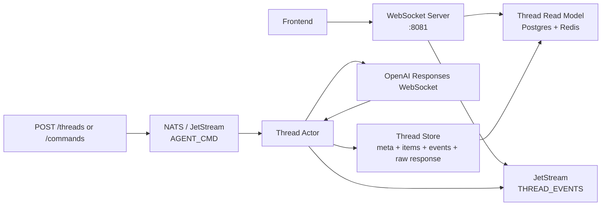

# Thread Stream Implementation

This note describes the end-to-end streaming pattern:

1. the worker owns the real OpenAI Responses WebSocket
2. the worker persists thread state, raw events, and normalized items
3. the worker publishes raw events to a NATS JetStream stream
4. a standalone WebSocket server subscribes to that stream and pushes events to the browser
5. the frontend connects to the WebSocket server and renders the thread

The important design choice is that the browser never talks to the worker's OpenAI socket directly, and the worker does not care about its consumers. It only cares about receiving OpenAI events, persisting them, and making them available on the stream.

## Why the Worker Should Not Know About Consumers

The worker's job is to own the OpenAI connection and persist thread state. That is it.

If the worker had to know about the WebSocket server, the browser, or any other downstream consumer, it would take on delivery responsibilities that belong elsewhere. The worker would need to track who is listening, batch events for different consumers, handle backpressure from slow readers, and manage connection lifecycle for things it does not own.

Instead, the worker does two things after receiving each OpenAI event:

1. persists to the durable store (Redis + Postgres)
2. publishes the raw event to JetStream

JetStream is the notification layer. Consumers subscribe when they need events, unsubscribe when they are done. The worker never blocks or changes behavior based on whether anyone is listening. If zero consumers exist, events are discarded after the stream's MaxAge. If ten consumers exist, JetStream handles fan-out and per-consumer acknowledgment.

This keeps the worker simple, testable, and independent of the delivery topology.

## The Three Services

### 1. Worker (`internal/worker`)

- Owns the OpenAI Responses WebSocket
- Receives commands via NATS JetStream (`AGENT_CMD` stream)
- Persists events and items to Redis + Postgres
- Publishes raw OpenAI events to JetStream (`THREAD_EVENTS` stream)
- Publishes thread-native item and state updates to JetStream as soon as they are persisted
- Does not know or care about the WebSocket server or browser

### 2. API Server (`internal/httpserver`)

- Exposes REST endpoints for thread CRUD, commands, repos, images
- No longer responsible for the browser WebSocket stream (moved to wsserver)
- Still serves as the command ingestion point: browser -> API -> NATS -> worker

### 3. WebSocket Server (`internal/wsserver`)

- Standalone service on its own port (default 8081)
- Exposes `GET /threads/{thread_id}/connect` for browser WebSocket connections
- Subscribes to JetStream `thread.events.{threadID}` for real-time event push
- Does one bootstrap read on connect for the current thread snapshot and any missed items after `after_item`
- Batches events before sending to the browser (10 events or 50ms, whichever comes first)

## High-Level Flow



## Worker-Side Flow

The worker path is the runtime.

Relevant files:

- `internal/worker/actor.go`
- `internal/worker/service.go`
- `internal/openaiws/session.go`
- `internal/threadstore/store.go`

### Start / Resume

For a new thread or a resumed thread, the actor:

1. claims ownership of the thread
2. ensures the OpenAI session exists
3. appends the input items into the thread item log as `direction=input`
4. builds a Responses-style `response.create` payload
5. sends that payload over the worker-owned OpenAI WebSocket

Current entry points:

- `handleStart`
- `handleResume`
- `continueWithInputItems`
- `sendAndStream`

In the code, `sendAndStream` also persists the outbound client event as:

- `client.response.create`

That means the system stores both:

- what we sent to OpenAI
- what OpenAI streamed back

### Streaming OpenAI Events

After `response.create`, the actor enters `streamUntilTerminal`.

Inside that loop it:

1. reads each inbound OpenAI event from the worker session
2. appends the raw event to the thread event log (durable store)
3. publishes the raw event to JetStream (`thread.events.{threadID}`)
4. stores raw response payloads when available
5. extracts normalized output items from `response.output_item.done`
6. appends those items to the thread item log
7. updates thread meta like:
   - `status`
   - `active_response_id`
   - `last_response_id`
   - `active_spawn_group_id`

Whenever the worker appends an item or changes frontend-relevant thread state, it also publishes a thread-native event to JetStream immediately:

- `thread.item.appended`
- `thread.snapshot`

The JetStream publish is fire-and-forget. If it fails, the worker logs a warning and continues. The durable store write is the source of truth. JetStream is a best-effort real-time notification layer.

### What Gets Persisted

The thread store keeps four things that matter here:

#### Thread meta

- current status
- owner worker
- socket generation
- last response id
- active response id

#### Item log

Normalized thread items in sequence order.

Examples:

- input messages
- assistant messages
- function calls
- function call outputs

#### Event log

Raw socket event envelopes in sequence order.

Examples:

- `client.response.create`
- `response.created`
- `response.in_progress`
- `response.output_item.done`
- terminal events

#### Raw response payloads

Stored by `response_id`

This gives us a thin Responses-native audit trail.

## JetStream THREAD_EVENTS Stream

The worker publishes raw OpenAI events to a JetStream stream so downstream services can consume them in real time without polling the database.

Relevant files:

- `internal/threadevents/threadevents.go`
- `internal/natsbootstrap/threadevents.go`

### Stream Configuration

- **Name**: `THREAD_EVENTS`
- **Subjects**: `thread.events.>`
- **Retention**: `InterestPolicy` — messages are kept only while active consumers exist that have not acked them
- **Storage**: `MemoryStorage` — these are ephemeral relay messages, the durable copy lives in Postgres
- **MaxAge**: 5 minutes — safety net for orphaned messages when no consumers are present

Interest-based retention means that if nobody is listening for a thread's events, messages are discarded. This is correct because the durable store already has them. The stream exists only for real-time push.

### Message Format

Each NATS message is a JSON envelope wrapping the raw OpenAI event:

```json
{
  "thread_id": "thr_abc123",
  "event_type": "response.output_text.delta",
  "socket_generation": 3,
  "ts": "2026-04-07T12:00:00.123456789Z",
  "payload": { ... }
}
```

- **Subject**: `thread.events.{threadID}`
- **Dedup header**: `Nats-Msg-Id: {threadID}-{socketGeneration}-{eventSeq}`
- **Payload field**: the raw OpenAI `ServerEvent` JSON, exactly as received from OpenAI

The envelope adds just enough metadata for consumers to route and deduplicate without parsing the full payload.

## WebSocket Server Flow

The browser connects to:

- `GET /threads/{thread_id}/connect`

This endpoint is served by the standalone WebSocket server, not the API server.

Relevant files:

- `internal/wsserver/server.go`
- `internal/wsserver/client.go`
- `cmd/wsserver/main.go`

### Why It Is a Separate Service

The WebSocket server's only job is to push thread state to browsers. It does not handle REST endpoints, command dispatch, or any write operations.

Separating it means:

- the API server stays focused on request/response endpoints
- the WebSocket server can scale independently based on connected client count
- a crash in the WebSocket server does not affect the API or worker
- the worker remains completely unaware of how many browsers are watching

### Connection Flow

When a browser connects:

1. accept the WebSocket
2. load the thread from the database
3. send an initial `thread.snapshot`
4. create an ephemeral JetStream subscription to `thread.events.{threadID}` with `DeliverNew`
5. start the event loop

### Event Loop

The WebSocket server runs two concurrent concerns per client:

**Real-time events from NATS**:

Events arrive from the JetStream subscription. They are buffered and flushed to the browser when either:

- 10 events accumulate
- 50ms have passed since the first buffered event
- a terminal event arrives (`response.completed`, `response.failed`, `response.incomplete`)

Events are sent as `thread.events.delta` messages containing the raw OpenAI event payloads.

**Thread-native updates from NATS**:

The worker publishes `thread.item.appended` as soon as an input or output item is persisted, and `thread.snapshot` as soon as the frontend-relevant thread state changes.

The WebSocket server forwards those immediately as:

- `thread.items.delta`
- `thread.snapshot`

This removes the recurring item and snapshot pollers from the live stream path.

**Heartbeat**:

A `thread.heartbeat` message is sent every 20 seconds to keep the connection alive.

### What the WebSocket Server Sends

Message types:

- `thread.snapshot`
- `thread.items.delta`
- `thread.events.delta`
- `thread.heartbeat`

These are the same message types as the previous API WebSocket. The frontend does not need to change its message handling.

#### `thread.snapshot`

Contains the current thread view.

On initial connect, the server still sends a bootstrap snapshot from the read model.

After that, snapshots are pushed from worker-published thread state updates instead of a timer.

This is what the frontend uses to understand whether the thread is still running, ready, failed, and so on.

#### `thread.items.delta`

Contains any new items after the last seen item cursor.

This is the main UI payload because chat rendering is item-driven, and it now arrives as soon as the worker persists an item instead of waiting for a poll interval.

#### `thread.events.delta`

Contains batched raw OpenAI events received from JetStream.

The frontend does not render these yet, but the stream includes them so we have the option to build richer live diagnostics later (streaming text deltas, reasoning indicators, tool call progress).

#### `thread.heartbeat`

Keeps the browser connection warm and gives the UI a simple liveness signal.

## Frontend Flow

Relevant files:

- `frontend/src/useChat.ts`
- `frontend/src/api.ts`
- `frontend/vite.config.ts`

### Initial Load

When the user opens a thread, the frontend still does an initial HTTP load for:

- `GET /threads/{thread_id}` (via API server)
- `GET /threads/{thread_id}/items?limit=200` (via API server)

That gives the page an immediate baseline without waiting for websocket deltas.

### Opening the Browser Socket

After the initial load, the frontend opens a WebSocket to the WebSocket server:

- `/stream/threads/{thread_id}/connect`

The Vite dev proxy rewrites `/stream` to the WebSocket server at port 8081.

If it already knows the last item cursor, it sends:

- `?after_item=<last_cursor>`

That means the socket can begin with only new items instead of replaying the whole thread.

The WebSocket server does a one-time catch-up read after subscribing so reconnects can recover missed items without a recurring poller.

### Consuming Messages

Current behavior in `useChat`:

- `thread.snapshot`
  - updates thread status
  - sets `busy`
  - updates the model label
- `thread.items.delta`
  - converts new item records into chat messages
  - merges them into the local message list
  - advances the last seen item cursor
- `thread.events.delta`
  - currently ignored by the chat UI
- `thread.heartbeat`
  - currently ignored by rendering

### Reconnect Behavior

If the socket closes unexpectedly, the frontend reconnects with exponential backoff:

- starts at `1s`
- caps at `10s`

This prevents the dev console and server from getting hammered if the backend stream is temporarily unavailable.

## Deployment

### Docker Compose

The WebSocket server runs as a separate container:

```yaml
wsserver:
  build: .
  entrypoint: ["wsserver"]
  ports:
    - "${WS_PORT:-8081}:8081"
  environment:
    PORT: "8081"
    NATS_URL: nats://nats:4222
    REDIS_URL: redis://redis:6379/0
    POSTGRES_DSN: "postgres://..."
  depends_on:
    redis, postgres, nats
```

It only needs NATS, Redis, and Postgres. No OpenAI credentials, no blob storage.

### Vite Proxy

The frontend dev server proxies WebSocket connections:

- `/stream/*` -> `http://wsserver:8081/*` (with `ws: true`)
- `/threads/*` -> `http://api:8080/threads/*` (REST only, no `ws`)

## Why This Pattern Works

### Worker stays simple

- only the worker owns the OpenAI socket
- only the worker writes `response.create`
- only the worker turns live OpenAI events into runtime state
- the worker publishes to JetStream but does not care who consumes
- if NATS publish fails, the worker logs and continues — it never blocks

### Delivery is decoupled

- the WebSocket server subscribes to JetStream and pushes to browsers
- it can scale horizontally based on connected client count
- adding new consumers (monitoring, logging, analytics) does not require any worker changes

### Persistence is still the source of truth

The durable store (Redis + Postgres) remains the source of truth for thread state.

JetStream is a real-time notification layer, not a durability requirement.

The durable store is what makes reconnect and reload safe. The browser bootstraps from HTTP, and the WebSocket server does a one-time catch-up read on connect before switching to push-only delivery.

## Mental Model

- the worker websocket is the execution stream
- JetStream is the real-time notification bus
- the durable store is the truth boundary
- the WebSocket server is the projection stream
- the frontend renders the projection

So the actual pattern is:

1. worker talks to OpenAI
2. worker persists events and items
3. worker publishes raw events to JetStream
4. WebSocket server subscribes to JetStream and tails the DB
5. frontend renders those deltas live
